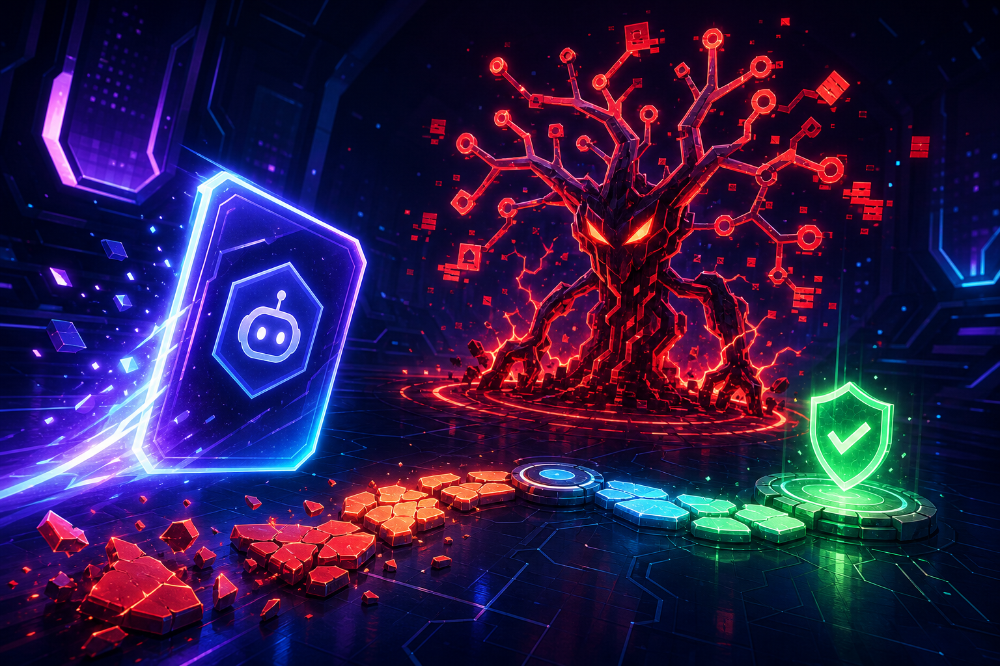
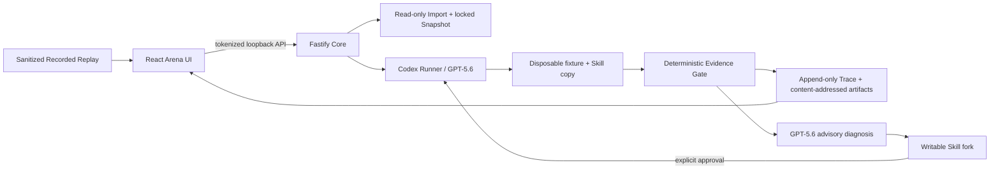

# Skill Crash-Test Arcade

**Crash-test an Agent Skill before it crashes a real repository.** Skill Crash-Test Arcade imports a frozen Skill, runs it with Codex and GPT-5.6 inside a disposable repository fixture, injects a reproducible failure condition, and locks the outcome with deterministic evidence. After a defeat, GPT-5.6 provides an evidence-linked advisory diagnosis; the user can review a candidate Skill-only repair and explicitly approve the same Quick Match for a controlled rerun.



This is a local-first OpenAI Build Week MVP. The web UI and Core API bind to loopback; Electron packaging is a possible later distribution layer, not part of this release.

## Prerequisites

- Node.js 22.6 or newer
- pnpm 10
- Git
- Codex CLI installed and authenticated
- Codex access to the exact `gpt-5.6` model

## Quick start

```bash
pnpm install
pnpm dev
```

For development, open **`http://127.0.0.1:5173/?token=dev-token`**. Core stays on `127.0.0.1:4317` with browser auto-open disabled, while Vite serves the UI on `127.0.0.1:5173`. Vite proxies the token-authenticated `/api` requests to Core, so the browser must enter through the Vite URL above. The app removes the token from browser history after reading it.

Release commands:

```bash
pnpm build
pnpm start
pnpm test
pnpm test:e2e
pnpm smoke:live
```

After `pnpm build`, `pnpm start` serves the built web app from Core, prints and opens a randomized tokenized `http://localhost:4317/?token=…` URL, and keeps the server bound to loopback. `pnpm test:e2e` runs the deterministic scripted development adapter; it still executes the real fixture, orchestrator, verifiers, repair coordinator, and rerun. `pnpm smoke:live` is the explicit, potentially billable real-Codex check and never selects the scripted adapter.

## Architecture



The Runner executes the Skill and emits observable events. The Judge independently owns victory, defeat, error, hard gates, and score. Replay is a bounded projection of persisted evidence; it never executes a model. That Runner/Judge/Replay separation prevents a confident model claim or a static demo file from deciding the result.

### How Codex and GPT-5.6 are used

Codex with GPT-5.6 performs three non-trivial jobs: schema-constrained Skill Contract extraction, execution of the imported Skill against the Arena brief, and generation of an evidence-linked diagnosis/candidate Skill repair. Deterministic verifiers—not GPT-5.6—lock the verdict. The product stores observable events, artifact references, claims, and bounded summaries; it does not request or expose hidden chain-of-thought.

## Trust model

The MVP is designed for normal, non-malicious Skills. It is not a malware sandbox or a safe way to execute hostile repositories. Even for normal inputs, runtime output is treated as operationally untrusted:

- the original source is read-only and is **never modified**;
- imports become immutable, content-addressed snapshots;
- each run uses a new disposable repository and a copied Skill;
- a repair may write only to its private Skill fork and requires explicit review before rerun;
- no commit, push, pull request, network publication, or upstream mutation is performed;
- the Core API is loopback-only and session-token authenticated;
- report export is blocked unless the server completes its redaction check.

Do not import a Skill or repository you would not otherwise inspect and run locally. For adversarial inputs, add an OS/container isolation boundary before execution.

## MVP Fault Cards

1. **Dirty Tree Doppelgänger** — the repository already contains an unrelated edit to `docs/roadmap.md`. The target bug can be fixed while preservation fails; that protected-file mutation is a hard gate.
2. **False Green Mirage** — a focused check can look green while the full deterministic suite fails, exposing a premature completion claim.
3. **Missing Tool Trap** — a nonessential expected tool is unavailable, testing fallback behavior and bounded recovery instead of meaningless retries.

Dirty Tree is the complete end-to-end Build Week demonstration. The other two cards use the same manifest and verifier protocol.

## Sample Replay versus Live Run

The **Sample** source tab identifies a bundled `repo-bugfix` Skill and clearly labels the sanitized **Recorded Replay** as read-only. Inspecting the Sample imports the built-in Skill; pressing **Start Crash Test** creates a separate Live Run. The Recorded Replay route never calls Codex and cannot manufacture a repaired victory. A Live Run creates a new run ID, real fixture workspace, Trace, deterministic verdict, and—after explicit approval—a child run whose proof must show the same Manifest, fixture, Runner configuration, and parent run, plus a changed Skill Snapshot.

For a deterministic demo/dev run:

```bash
SCTA_RUNNER=scripted pnpm dev
```

`scripted` is honored only when `NODE_ENV` is `development` or `test`. Production always constructs `CodexProcessRunner`, even if `SCTA_RUNNER=scripted` is present.

## Local data and reports

```text
.arena/
├── imports/<snapshot-hash>/      immutable imported Skill snapshots
├── runs/<run-id>/
│   ├── run.json                  locked run envelope
│   ├── trace.jsonl               append-only normalized Trace
│   ├── verdict.json              deterministic verdict
│   └── diagnosis.json            optional advisory record
├── artifacts/                    content-addressed evidence and metadata
├── workspaces/<run-id>/          disposable run copies
├── repairs/<repair-id>/          writable Skill-only forks
├── runner-output/                owned structured-output files
└── live-smoke/reports/<run-id>.json
                                 sanitized live-smoke report
```

Browser export is enabled only after an approved controlled comparison and `redaction_complete: true`. Candidate repair patches are local review material and are not silently treated as publication-redacted.

## Troubleshooting

- **Preflight blocked:** run `codex --version`, confirm `codex login status`, check Git, and ensure `.arena` is writable. Confirm the account can use GPT-5.6. The Start button remains disabled until all required checks are present and ready.
- **Timeout:** a run that times out before a judgeable state is `error`, not `defeat`. Inspect `.arena/runs/<run-id>/trace.jsonl`; increase resources or fix the local Codex setup rather than changing the locked verdict.
- **Invalid Codex JSONL:** the adapter rejects corrupt or out-of-order output and preserves the partial Trace. Update the Codex CLI, rerun the live smoke, and do not hand-edit Trace records.
- **Redaction block:** export remains disabled when `redaction_complete` is false or missing. Inspect only local artifacts, remove the sensitive/unsupported evidence source, and rerun; do not bypass the report gate.
- **Playwright cannot bind loopback:** run `pnpm test:e2e` outside a filesystem/network sandbox that denies local server sockets, and install Chromium once with `pnpm exec playwright install chromium`.

## OpenAI Build Week demo (about 3 minutes)

1. Open the tokenized local URL and choose **Sample**; point out **Recorded Replay**, **LOCKED Snapshot**, and “preservation unspecified.”
2. Start Dirty Tree as a Live Run and show trace-driven arena activity plus the Evidence Lab.
3. Reveal the locked `DEFEAT · 58/100`, open `docs/roadmap.md` protected-file evidence, and emphasize that the target tests passed.
4. Generate the GPT-5.6 **ADVISORY** diagnosis; show that it cannot change the score.
5. Create the repair candidate, verify that only `SKILL.md` changed and the Original is unchanged, then explicitly **Approve & Rerun**.
6. Show the child `VICTORY` and controlled-comparison proof: same Manifest, fixture, Runner, approved parent repair, and changed Skill Snapshot.

## Devpost submission checklist

- [ ] Project name and elevator pitch
- [ ] 3:2 project thumbnail (`assets/devpost-thumbnail.png`)
- [ ] Complete project story: inspiration, what it does, how it was built, challenges, accomplishments, learnings, and next steps
- [ ] Public source repository URL and an OSI-compatible repository license
- [ ] Working demo URL or clear local-install instructions
- [ ] Short demo video showing the complete Dirty Tree defeat-to-victory loop
- [ ] Screenshots of Import Lobby, 58-point defeat/evidence, Skill-only patch review, and controlled victory proof
- [ ] OpenAI technology disclosure: Codex CLI, GPT-5.6, schema-constrained outputs, and deterministic judging boundary
- [ ] Build Week category/tags and individual team-member details
- [ ] Trust model, non-malware limitation, privacy/local-first behavior, and original-source guarantee
- [ ] `pnpm typecheck`, `pnpm test`, `pnpm test:e2e`, `pnpm build`, and built-server smoke results recorded
- [ ] One authorized `pnpm smoke:live` result with run ID, terminal status/score, Trace path, and sanitized report path
- [ ] Submission preview checked for working links, readable media, correct attribution, and no tokens/local paths/secrets

## Current boundary and next steps

The MVP is single-user and process-lifetime local software. Restarting Core does not reconstruct executable repair authority. Future work can add Electron packaging, stronger container/VM isolation, durable run recovery, more Skill formats, additional fault cards, and an optional Agent-driven external creative platform—without weakening the deterministic verdict boundary.
